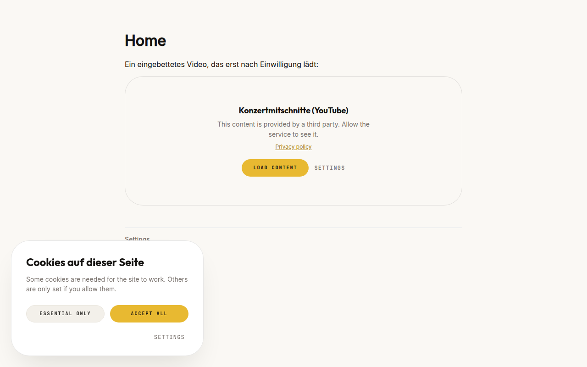
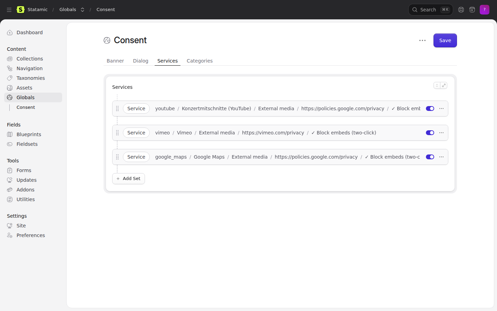
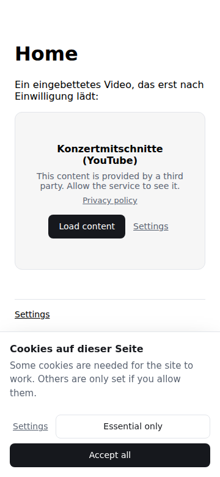
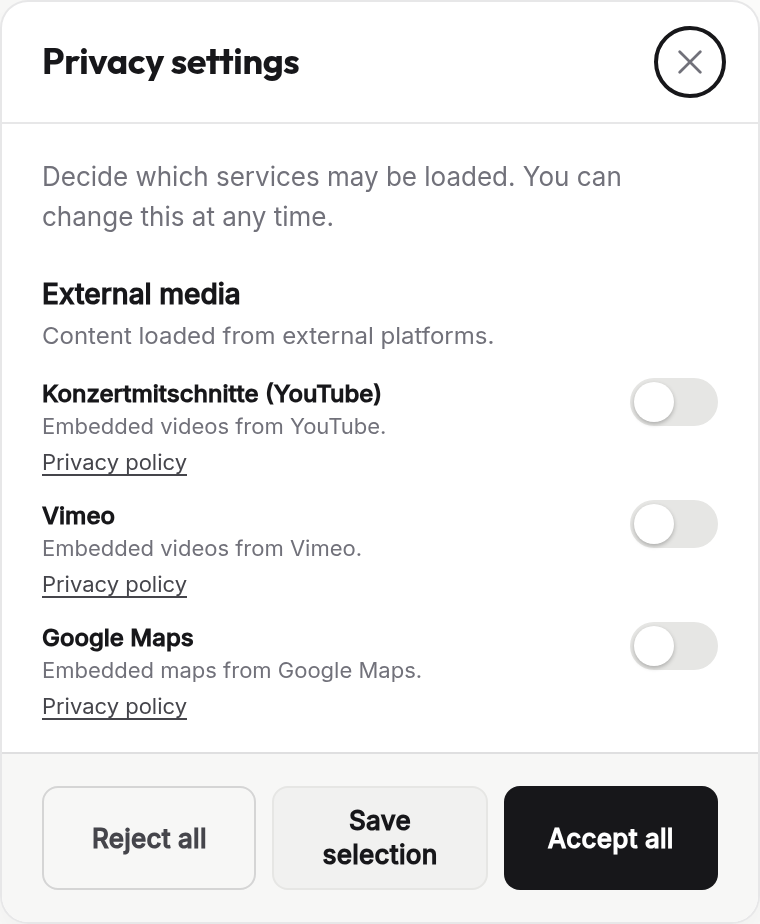
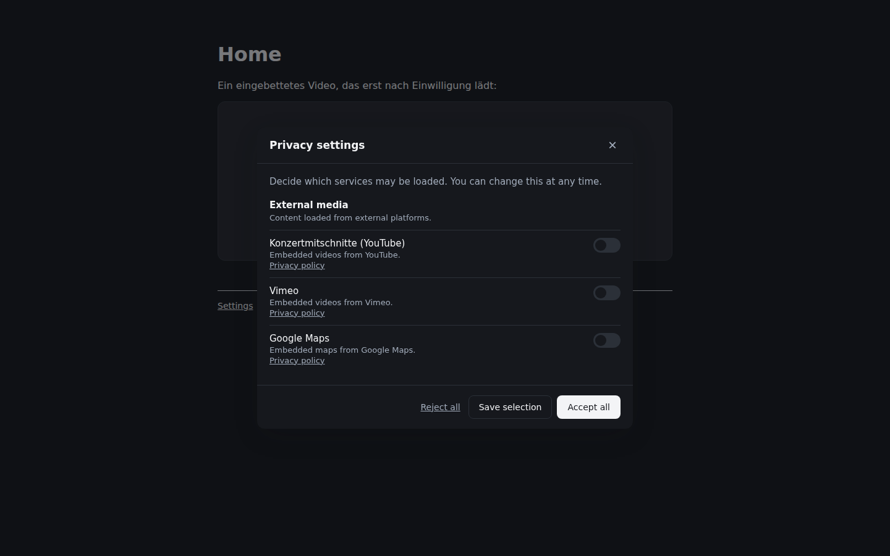

<!-- statamic:hide -->
# Statamic Consent
> Cookie banner and two-click embed gate, editable in the control panel.
<!-- /statamic:hide -->

Built for sites where the same person maintains the site and answers for it: the wording lives in a
global set the client can edit, the handles live in the config file the developer controls, and a
blocked embed is genuinely absent from the page rather than hidden with CSS.





## Requirements

Statamic 6 · PHP 8.2+ · no queue, no database, no build step.

## Installation

```bash
composer require goldnead/statamic-consent
php please consent:install
```

(Under `php artisan` the same command is `statamic:consent:install`; `please` drops the prefix.)

The install command publishes the assets to `public/vendor/statamic-consent`, publishes the
blueprint to `resources/blueprints/globals/consent.yaml`, and creates the **Consent** global set. It
then appears in the control panel under **Globals → Consent**.

**Nothing renders until you add a service.** No services ship, so a fresh install leaves the site
exactly as it was — see "When there is nothing to ask" below. Add the ones this site actually loads,
in the control panel or in the config file.

**Re-run `php please consent:install` after every update.** The assets are overwritten on purpose: a
half-updated pair of `consent.js` and `consent.css` behaves like the previous release.

## Usage

In your layout:

```antlers
<head>
    {{ consent:head }}
</head>
<body>
    ...
    <footer>{{ consent:settings_link }}</footer>
    {{ consent:banner }}
</body>
```

`{{ consent:settings_link }}` belongs on every page. A decision that cannot be revisited is not a
decision that was freely given.

### Blocking an embed

```antlers
{{ consent:gate service="youtube" title="Konzertmitschnitt" cover="/img/cover.jpg" }}
    <iframe src="https://www.youtube.com/embed/xyz" allowfullscreen></iframe>
{{ /consent:gate }}
```

The iframe is parked in a `<template>`. Browsers parse a template but issue no requests for what is
inside it, so nothing reaches YouTube until the visitor presses the button. Rendering the iframe and
hiding it with CSS would look identical and be exactly the violation this tag exists to prevent.

A gate naming a service that is not configured stays blocked and says so, rather than falling
through — a typo must not publish an unconsented embed.



### Blocking a script

```html
<script type="text/plain" data-consent-service="analytics_pixel" src="https://…"></script>
```

Parked scripts are re-created as real script elements once the service is allowed. Setting `.type` on
the existing node would do nothing; the browser decided how to treat it at parse time.

### Tags

| Tag | Parameters | What it does |
|---|---|---|
| `{{ consent:head }}` | — | Stylesheet, inline configuration, script. Belongs in `<head>`. |
| `{{ consent:banner }}` | — | The banner and the settings dialog. Belongs before `</body>`. |
| `{{ consent:gate }}` | `service` (required), `title`, `cover` | Two-click gate around an embed. |
| `{{ consent:granted }}` | `service` (required) | Renders its contents only with consent, server-side. |
| `{{ consent:settings_link }}` | `label`, `class` | A button that reopens the dialog. |

`{{ consent:granted }}` reads the cookie on the server, so it is wrong on a page served from a
full-page cache. Use the gate for anything that loads a third party; use `granted` for prose.

The cookie is written by JavaScript and is therefore not encrypted, so the addon registers it with
`EncryptCookies::except()` on boot. Without that Laravel discards it and the server sees no cookie
at all — which looks exactly like "nobody has consented yet". If you rename the cookie in a
published config, the exemption follows the new name.



## Configuration

`config/statamic-consent.php` owns the handles, the cookie and the behaviour. The **Consent** global
set owns the wording and overrides the config key by key — a field left empty falls back to the
shipped text in the visitor's language rather than rendering blank.

A **list** emptied in the control panel stays empty. Deleting every service is an answer, not a
missing value, and the addon does not hand back what someone removed.

| Key | Default | What happens when it is wrong |
|---|---|---|
| `cookie.name` | `statamic_consent` | Renaming it after launch discards every stored decision; every visitor is asked again. |
| `cookie.days` | `182` | Longer than 12 months is not defensible under the GDPR. |
| `cookie.same_site` | `Lax` | `None` without `Secure` makes browsers drop the cookie entirely. |
| `version` | `1` | Raise it when you add a non-essential service. Leaving it lets an old yes cover something the visitor never saw. |
| `respect_gpc` | `true` | Honours the Global Privacy Control signal, which German courts have read as a valid objection. |
| `assets.styles` | `true` | Off means you ship your own CSS against the class names below. |
| `assets.scripts` | `true` | Off disables the addon entirely; nothing unlocks. |
| `categories` | four | A category with no services is dropped from the dialog. |
| `services` | **none** | Nothing ships. A service listed here appears in the banner, so an unused one describes data processing that does not happen. The `handle` is what templates refer to; renaming one after launch breaks every gate that names it. |

### Google Consent Mode v2

Off by default. Switch it on only where the site actually loads gtag — an addon that creates a
Google object on a site with no Google is the opposite of what it is for.

```php
'google_consent_mode' => [
    'enabled' => true,
    'signals' => [
        'analytics_storage' => ['google_analytics'],
        'ad_storage' => ['google_ads'],
        'ad_user_data' => ['google_ads'],
        'ad_personalization' => ['google_ads'],
    ],
    'wait_for_update' => 500,
],
```

`{{ consent:head }}` then writes the `consent default` call **inline and first**, before anything
else in the head, because Google's default has to be in place before any Google script loads. The
runtime sends `consent update` as soon as the visitor decides, and again on every later change.

A signal is granted only when **every** service mapped to it is granted. A signal with an empty list
stays denied — which is the right answer for anything you have not thought about yet.

### Making it yours

**The defaults are deliberately plain.** Near-black on near-white, a modest radius, ordinary
sentence-case buttons, and **no font of its own** — the banner inherits the site's faces. An
un-themed banner should read as *unstyled*, never as *someone else's brand*. Until 1.5.0 it did the
latter: it shipped one particular site's yellow, cream and pill buttons to everyone.

Start with the accent. Three properties usually get you the whole way:

```css
:root {
    --csnt-brand: #14504A;      /* the one accent: primary button, switch, focus ring */
    --csnt-brand-ink: #FBFCFA;  /* text on the accent */
    --csnt-radius-card: 0.25rem;
}
```

The full set, with the shipped defaults:

```css
:root {
    /* Surfaces and ink */
    --csnt-surface: #FFFFFF;                            /* card and panel */
    --csnt-surface-sunken: #F7F7F6;                     /* panel footer, blocked embed */
    --csnt-surface-muted: #F1F1F0;                      /* the secondary button */
    --csnt-surface-muted-line: #E6E6E4;
    --csnt-ink: #17171A;
    --csnt-ink-soft: #45454B;
    --csnt-muted: #71717A;                              /* body copy, captions */
    --csnt-faint: #A1A1AA;
    --csnt-line: rgba(23, 23, 26, 0.10);

    /* The accent */
    --csnt-brand: #17171A;                              /* the one accent: primary button, switch, focus ring */
    --csnt-brand-hover: #34343A;
    --csnt-brand-ink: #FFFFFF;                          /* text on the accent */
    --csnt-brand-deep: #45454B;                         /* links, hover */

    /* Shape */
    --csnt-radius-card: 1rem;
    --csnt-radius-panel: 0.875rem;
    --csnt-radius-inner: 0.5rem;                        /* the blocked-embed placeholder */
    --csnt-radius-button: 0.5rem;
    --csnt-radius-pill: 999px;                          /* the switch and the close button */
    --csnt-shadow-card: 0 20px 44px -20px rgba(23, 23, 26, 0.18);
    --csnt-shadow-panel: 0 20px 44px -20px rgba(23, 23, 26, 0.22);
    --csnt-shadow-knob: 0 1px 2px rgba(0, 0, 0, 0.25);  /* the switch's knob */

    /* Type — all three inherit from the site by default */
    --csnt-font: inherit;                               /* body */
    --csnt-font-display: inherit;                       /* headings */
    --csnt-font-ui: inherit;                            /* buttons, captions */

    /* Button, label and heading typography */
    --csnt-btn-size: 0.8125rem;
    --csnt-btn-weight: 600;
    --csnt-btn-tracking: 0.01em;
    --csnt-btn-transform: none;
    --csnt-label-tracking: 0.08em;                      /* the small captions */
    --csnt-label-transform: uppercase;
    --csnt-title-weight: 700;
    --csnt-title-tracking: -0.01em;

    /* Mechanics */
    --csnt-z: 2147483000;                               /* above everything; mechanics, not a look */
}
```

The banner is a card in the bottom-left corner, the settings panel in the opposite one.

**Dark mode is opt-in.** Set `data-consent-theme="dark"` on `<html>` for always dark, or `"auto"` to
follow the operating system. Without it the banner stays light, because a widget that follows
`prefers-color-scheme` on its own puts a dark dialog on a light site.

**Your tokens win over the dark theme, in both directions.** The three token blocks in the shipped
stylesheet sit in a `@layer`, and unlayered CSS beats every layer — so a plain `:root { --csnt-brand:
… }` of yours survives dark mode instead of being silently replaced by it. The flip side is that it
survives *literally*: if you set a dark accent and then switch dark mode on, it stays dark on dark.
Give the dark theme its own values when you use one:

```css
:root { --csnt-brand: #14504A; --csnt-brand-ink: #FBFCFA; }

:root[data-consent-theme="dark"] { --csnt-brand: #7FB8AF; --csnt-brand-ink: #0C1F1C; }

@media (prefers-color-scheme: dark) {
    :root[data-consent-theme="auto"] { --csnt-brand: #7FB8AF; --csnt-brand-ink: #0C1F1C; }
}
```



To replace the stylesheet entirely, set `assets.styles` to `false` and write your own CSS against the
class names (`csnt-banner`, `csnt-panel`, `csnt-gate`, `csnt-btn`, `csnt-pill`, `csnt-switch`,
`csnt-caption`). **The class names and the published view paths
(`resources/views/vendor/statamic-consent/`) are public API**; the CSS rules are not.

### JavaScript

```js
StatamicConsent.granted('youtube')   // boolean
StatamicConsent.open()               // open the dialog
StatamicConsent.rejectAll()
StatamicConsent.reset()              // forget the decision, show the banner
document.addEventListener('consent:changed', e => e.detail.granted)
```

## When there is nothing to ask

If no optional service is configured — only essential ones, or none at all — `{{ consent:head }}`,
`{{ consent:banner }}` and `{{ consent:settings_link }}` render **nothing**. No stylesheet, no
script, no banner.

Strictly necessary cookies need no consent, so a site that loads no third party has nothing to put
in a banner. Asking anyway trains people to click the nearest button, which is the opposite of an
informed decision. It is also the state every installation is in on its first day: install the
addon, and the site is unchanged until you enter a service.

A `{{ consent:gate }}` still blocks in that state. Failing open is never the safe answer.

## Multi-site

**The wording is per site; the handles are shared.** The global set is localisable, so each site has
its own banner text and service names, and a site without its own localisation falls back to the
default site. Service handles come from the config file and are therefore identical everywhere — a
`{{ consent:gate service="youtube" }}` in a shared layout behaves the same on every site.

The consent cookie is per domain, as browsers define it. Sites on separate domains ask separately;
sites on paths of one domain share one decision.

## Proof of consent

Article 7(1) GDPR puts the burden of proof on you, and a value in the visitor's own browser is not
proof: it belongs to them and they can change it. Switch on a server-side record:

```php
'record' => [
    'enabled' => true,
    'keep_days' => 400,
    'rate_limit' => 30,
],
```

Then `php artisan migrate`. The migration only loads while the record is on, so a flat installation
that never wants one never gets a table.

**What is stored:** the random id from the cookie, a timestamp, the version consented to, the granted
handles, how the decision was made, and the site. **Deliberately not stored: IP address and user
agent.** Both are personal data in their own right and neither is needed — the id does the linking.
Storing them turns a proof log into a visitor database.

Look one up when someone asks:

```bash
php please consent:lookup 94a5dd75-f45a-4775-a061-7b17bfc81224
php please consent:lookup --latest=50
php please consent:lookup --csv=nachweis.csv 94a5dd75-…
php please consent:prune              # deletes past keep_days
```

Two things worth understanding. The endpoint takes **no input**: the browser pings, and the server
records what its own cookie says. Nothing in the request can be forged because nothing in it is read
— and a cross-site post arrives without the cookie, because `SameSite=Lax` does not send one. That is
also why it needs no CSRF token, which could not work on a cached page anyway.

And the record is a **side effect, never a step in the visitor's way**. If the write fails, the
visitor has still decided.

There is no control panel screen for this. A native listing in Statamic 6 means a Vue build, a
committed bundle and a CI job proving the bundle is current — machinery this addon deliberately does
not carry. For a lookup that happens when a lawyer writes, a command is the better trade.

## What it stores

A first-party cookie (`statamic_consent`, six months) and a localStorage mirror, holding the granted
handles, a timestamp, how the decision was made and a random id. **Nothing leaves your server** — the
addon has no telemetry and no phone-home. The proof log above is off unless you switch it on, and it
writes to your own database.

## Uninstalling

```bash
composer remove goldnead/statamic-consent
rm -rf public/vendor/statamic-consent resources/views/vendor/statamic-consent
rm resources/blueprints/globals/consent.yaml config/statamic-consent.php
rm -rf content/globals/consent.yaml content/globals/*/consent.yaml
```

Then remove the tags from your layout. Visitors keep a stale `statamic_consent` cookie until it
expires; it is inert.

## What this addon does not do

It is not a legal opinion, and it does not discover what your site loads. Every third party has to be
entered as a service, and an embed only gets blocked where a gate is put around it. It does not scan
your theme to check that you did.

## Tests

`composer test` runs the PHP suite. `npm test` runs the browser checks — the localStorage mirror,
Global Privacy Control and parked scripts live only in the browser, so they are exercised against a
fixture page rather than left to a reading of the source. It needs a Chrome on the machine
(`CHROME_PATH` if it is not at `/usr/bin/google-chrome`); no browser is downloaded.

## Support

Only the latest version is supported. Issues:
<https://github.com/goldnead/statamic-consent/issues>

## Changelog · License

[CHANGELOG.md](CHANGELOG.md) · [LICENSE.md](LICENSE.md)
